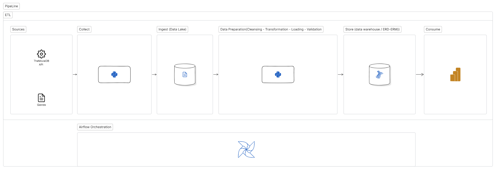
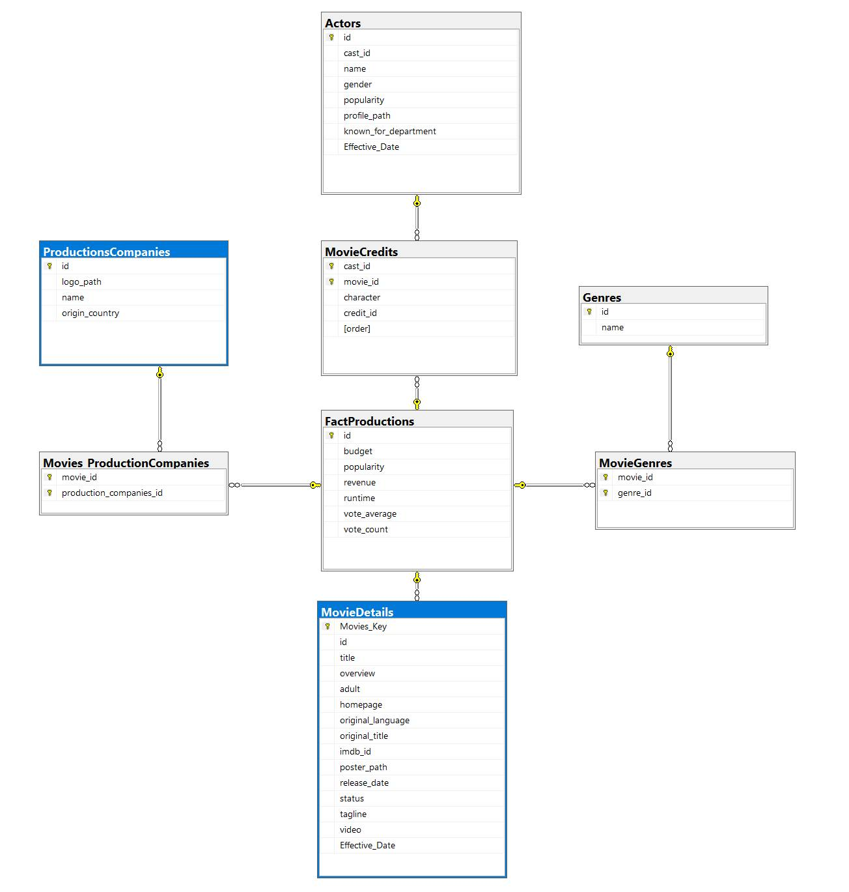
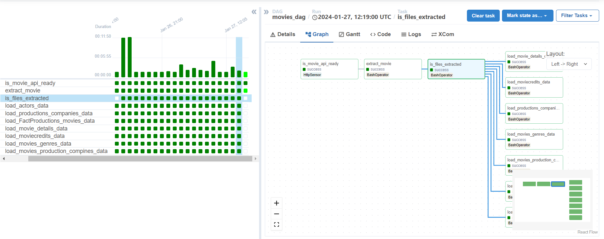
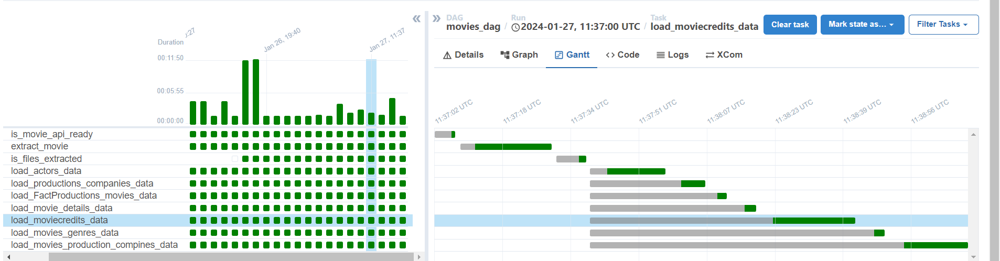

### **Introduction:**

This project aims to collect, ingest, store, and consume data from The Movie Database (TMDb) API using bash processing. For a comprehensive overview of the project's requirements, refer to the tools mentioned in the [`project's tools`](https://github.com/yassinessadi/fill-rouge-movies-leans-data/blob/main/docs/project-tools.md) README file.

### **Project Architecture:**

#### **`Sources`:**

[TMDb](https://www.themoviedb.org/settings/api) offers a powerful API service that is free to use as long as you properly attribute us as the source of the data and/or images you use.

#### **`Collect`:**

In this step, the goal is to create a logic that retrieves data from The Movie Database (TMDb) API based on two parameters. The first parameter involves fetching movies by popularity, and the second parameter relates to the number of movies per page.

To handle this, a logic has been implemented which utilizes a file to store the page index for each run. Essentially, during each run of the Airflow script, a page containing about 20 movies is obtained. For each call, the script extracts the movie ID, fetches details about the movie, as well as information about its cast.

**Columns Retrieved from API:**

1. **Cast Info:**

   - 'adult', 'gender', 'id', 'known_for_department', 'name', 'original_name', 'popularity', 'profile_path', 'cast_id', 'character', 'credit_id', 'order'

2. **Movies Info:**

   - 'adult', 'backdrop_path', 'belongs_to_collection', 'budget', 'genres', 'homepage', 'id', 'imdb_id', 'original_language', 'original_title', 'overview', 'popularity', 'poster_path', 'production_companies', 'production_countries', 'release_date', 'revenue', 'runtime', 'spoken_languages', 'status', 'tagline', 'title', 'video', 'vote_average', 'vote_count'

3. **Movies Cast:**
   - 'cast_id', 'movie_id', 'character', 'credit_id', 'order'

#### **`Ingest (Data Lake)`:**

The extracted data is subsequently stored in three distinct files named `movies_cast`, `movies`, and `cast`. The `movies_cast` file holds particular importance as it encompasses the relationships between movies and their respective cast. This step ensures the accurate association of cast members with their corresponding movies.

#### **`Data Preparation`:**

#### **`Store (Data Warehouse & Data Modeling)`:**

The `data modeling` below is designed specifically for analytical purposes in the realm of `movies`. This structured approach aims to optimize data storage and retrieval within the `data warehouse`, ensuring efficient and insightful analytics tailored to `movie-related` insights:

Slowly changing dimension ( SCD ):

> Type 1:
> method involves overwriting existing data with new data. This approach does not retain historical data, making it suitable for scenarios where tracking historical changes is not a requirement. In my specific case, as I retrieve movies based on popularity, historical tracking is not essential. Therefore, I opt to overwrite existing data if duplicates are found in my database, ensuring that the most up-to-date information is maintained.

example:

<table>
   <tr>
      <td>ID</td>
      <td>49049</td>
   </tr>
   <tr>
      <td>Budget</td>
      <td>$50,000,000</td>
   </tr>
   <tr>
      <td>Popularity</td>
      <td>35.251</td>
   </tr>
   <tr>
      <td>Revenue</td>
      <td>$41,037,742</td>
   </tr>
   <tr>
      <td>Runtime</td>
      <td>95 minutes</td>
   </tr>
   <tr>
      <td>Vote Average</td>
      <td>6.824</td>
   </tr>
   <tr>
      <td>Vote Count</td>
      <td>4767</td>
   </tr>
</table>

#### **`Airflow (Schedules the tasks)`:**

This process aims to automate the workflow. The Airflow scheduler runs every 7 minutes, executing the specified steps below to automate the workflow. Each step represents a Bash operation. For more details, refer to the comments below, which explain the workflow and the purpose of each step :

> [is_movies_api_ready](https://github.com/yassinessadi/fill-rouge-movies-leans-data/blob/main/app/dags/themoviedb_dag.py) : Verify The Movie Database (TMDb) API for data consumption.

> [extract_movie](https://github.com/yassinessadi/fill-rouge-movies-leans-data/blob/main/app/Extract/extract_movie_by_popular.py) : Retrieve movie data using the 'requests' module and store it in .txt files.

> [is_files_extracted](https://github.com/yassinessadi/fill-rouge-movies-leans-data/blob/main/app/load/_init_.py) : Verify the readiness of the files for use.

> [load_FactProductions_movies_data](https://github.com/yassinessadi/fill-rouge-movies-leans-data/blob/main/app/load/load_fact_movies.py) : This operation focuses on loading measurement data, acting as the fact table for movies

> [load_movie_details_data](https://github.com/yassinessadi/fill-rouge-movies-leans-data/blob/main/app/load/load_movie_details.py): Load data related to movies.

> load_actors_data : Load data related to cast (Actor , Crew).

> [load_production_compines_data](https://github.com/yassinessadi/fill-rouge-movies-leans-data/blob/main/app/load/load_productions_companies.py) : Load data related to production compines

> [load_movies_production_companies_data](https://github.com/yassinessadi/fill-rouge-movies-leans-data/blob/main/app/load/load_movies_production_compiens.py): Load data into the 'movies_production_companies' table, which acts as a linking table (bridge table) facilitating the association between movies and production companies.

> [load_moviecredits_data](https://github.com/yassinessadi/fill-rouge-movies-leans-data/blob/main/app/load/load_moviecredits.py) : load data to bridge table between movies and casts.

The Gantt chart of the Airflow scheduler is shown in the image below, indicating the time taken for each task to complete the process.

