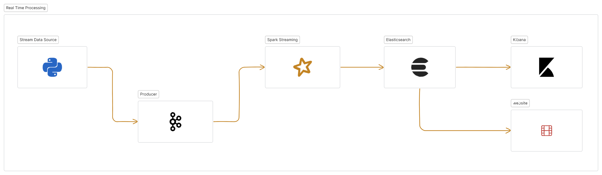

### **Introduction:**

This project aims to collect, ingest, store, and consume data from The Movie Database (TMDb) API using bash processing. For a comprehensive overview of the project's requirements, refer to the tools mentioned in the [`project's tools`](https://github.com/yassinessadi/fill-rouge-movies-leans-data/blob/main/docs/project-tools.md) README file.

### **Project Architecture:**



```
├──project_root
│    │
│    api/
│    │ └──
│    │
│    app/
│    │
│    ├── kafka_producer/
│    │   ├── src/
│    │   │   └── producer.py
│    │   │       └──broadcast (latest movies data)
│    │   ├── config/
│    │   └── requirements.txt
│    │
│    ├── pyspark_consumer/
│    │   ├── src/
│    │   │   └── consumer.py
│    │   │       ├── read stream (pyspark stream)
│    │   │       ├──Transformation (handle missing values ...)
│    │   │       └──loader (mongodb)
│    │   ├── config/
│    │   └── requirements.txt
│    │
│    │
│    ├── common_utils/
│    │   ├── src/
│    │   │   └── utils.py
│    │   └── requirements.txt
│    │
│    └── requirements.txt
│
└── README.md
```
